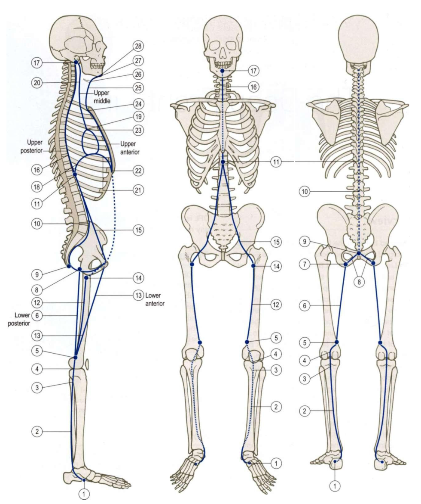

# Deep Front Line

*Fig. 9.2 Deep Front Line tracks and stations (Anatomy Trains, Thomas W. Myers).*

## Anatomy Trains Tracks & Bony Stations (Table 9.1)

| Level | Type | Anatomical Station / Myofascial Track |
|---|---|---|
| Cranium / Mandible | **Station** | Basilar portion of occiput, cervical TPs, hyoid bone, mandible |
| Neck / Deep Cervical | **Track** | [[longus_capitis]], [[longus_colli]], [[scalenes]], infrahyoids, suprahyoids |
| Thorax / Ribs | **Station** | Posterior manubrium, subcostal cartilages, xiphoid process |
| Thoracic Cavity | **Track** | Fascia endothoracica, transversus thoracis, [[diaphragm]], pericardium, mediastinum |
| Spine | **Station** | Lumbar vertebral bodies & anterior longitudinal ligament |
| Pelvis / Deep Core | **Track** | [[psoas_major]], [[iliacus]], [[pectineus]], pelvic floor fascia ([[transversus_abdominis]]) |
| Pelvis / Femur | **Station** | Ischial ramus, linea aspera, lesser trochanter |
| Thigh / Medial | **Track** | [[adductor_magnus]], [[adductor_longus]], [[adductor_brevis]], [[gracilis]] |
| Knee | **Station** | Medial femoral epicondyle, posterior tibia/fibula |
| Lower Leg | **Track** | [[popliteus]], [[tibialis_posterior]], [[flexor_hallucis_longus]], [[flexor_digitorum_longus]] |
| Foot | **Station** | Plantar tarsal bones & plantar surface of toes |

## Definition

The Deep Front Line is an Anatomy Trains model of deep continuity from the plantar foot and inner leg through the pelvis and respiratory trunk toward the neck and jaw region.

## Why It Matters

It provides a stable anatomical bridge from foot/ankle and deep-leg structures to the pelvis and trunk without turning visible arch, breathing, neck, or jaw behaviour into a diagnosis.

## Stable Anatomy (Level 1 & 2)

The cited model includes [[plantar_fascia]], [[tibialis_posterior]], long toe flexors, [[popliteus]], adductors, psoas/iliacus, [[diaphragm]], quadratus lumborum, transversus abdominis, deep neck structures, and jaw-related muscles. Membership is anatomical Level 1 support, not evidence of simultaneous activation or load transfer during golf.

## Golf Application Interpretation (Level 3 & 4 context)

Kwon describes the external mechanics; the following line mapping is the vault's Anatomy Trains-based golf interpretation.

The explicit bridge is foot/ankle -> [[plantar_fascia]]/deep leg -> [[deep_front_line]] -> adductors/pelvis -> diaphragm and trunk. It can connect onward to Functional Lines through the adductor and abdominal-wall region. External GRF and moments do not establish deep-line tension, breathing strategy, or jaw loading.

| Swing phase | External/mechanical context | Anatomical bridge | Line role | Evidence boundary |
|---|---|---|---|---|
| [[address_to_shaft_parallel]] | No phase-specific force or moment direction is assigned. | Foot/ankle -> plantar fascia/deep leg -> pelvis | stabilising | Structural route is Level 1; phase role is interpreted. |
| [[shaft_parallel_to_end_pelvis_rotation]] | EPR can anchor timing; kinetics require compatible instruments. | Deep leg/adductors -> pelvis and trunk | stabilising | Activation and tissue loading are unknown. |
| [[golf_swing_transition]] | Instrumented GRF and moments may contextualise transition. | Plantar foot -> deep leg -> pelvis/diaphragm | loading | Kwon does not establish DFL loading or breath holding. |
| [[max_unweighting_to_impact]] | The source-labelled boundary is not measured vertical GRF. | Pelvis/trunk -> deep anterior pathway | role uncertain | Evidence is insufficient for a universal release role. |

## App Hypotheses (Level 5)

Camera data may describe foot geometry, hip-midpoint motion, pelvis orientation, and phase timing under declared view limits. Ordinary video cannot measure pressure, GRF, moments, breathing mechanics, muscle activation, fascial tension, DFL loading, or energy storage, transfer, release, or dissipation. Neck or jaw landmarks must not be used to diagnose bracing or prescribe treatment.

## Gait Role (Engine Synthesis, Level C)

See [[gait_myofascial_mapping]] for the full synthesis. Summary for this line:

- **Phase role:** Initiates the step (psoas/iliacus from T12/L1). Provides inner-leg stability from the medial arch up to the medial hip, guiding the hip and preventing excess rotation. Ideally tensions through its entire length at toe-off (toe extension + ankle DF + knee extension + hip extension/IR/abduction + thoracic extension). Active in [[preswing]], [[initial_swing]], and [[terminal_stance]].
- **Restriction pattern:** Short DFL → dropped medial arch, knee tracking medially (adductor overactivity), poor swing initiation. Separately, a knee that cannot **unlock** from full extension is a DFL popliteus **underactivity / failed-unlock** problem (NOT popliteus shortness — short popliteus would bias toward flexion/IR, the opposite). Popliteus note is (C) general DFL anatomy, not Earls gait; Ch.10 gait text does not discuss popliteus.
- **Compensation signature when restricted:** delayed swing initiation, stiff-knee gait, dropped medial arch — compensating via [[superficial_front_line]] (compensatory hip flexion) and [[lateral_line]] (hip hike).
- **Best observed from:** **front view** (medial arch, knee valgus, adductor-driven medial knee tracking are frontal-plane findings only visible from the front). Side view adds the sagittal "locked knee" sign; back view is largely blind to DFL medial findings.
- **Spine in gait:** DFL crosses the cervical spine via longus colli/longus capitis/scalenes, the thoracic spine via diaphragm/endothoracic fascia, and the lumbar spine via psoas/QL/TVA. Four **independent** DFL restriction/control patterns (each caused by DFL shortness/underactivity at that segment's point on the line, not by one causing the other): (1) restricted **neck extension** (forward head, DFL longus colli shortness at the cervical point); (2) restricted **thoracic extension** (DFL diaphragm binding at the thoracic point); (3) lumbar **lordosis / anterior pelvic tilt** (short iliopsoas classically presents as anterior pelvic tilt + lumbar hyperextension, NOT lumbar flexion — listed separately from the lumbar-extension-restriction row, which is an SFL rectus-abdominis pattern); (4) lumbar **shear/instability** (DFL core underactivity). Separately, the source (Ch.10) establishes the DFL tensions through its entire length at toe-off and that a restriction anywhere reduces the **elastic recoil** distally — this is an elastic-loading effect, not a segment-to-segment ROM restriction effect. See [[gait_myofascial_mapping]] Whole-chain insight for the evidence boundary.

All mappings are `engine_synthesis` (C); not measured kinetics or causal proof. The **phase role** is directly supported by the source (Myers/Earls Ch.10 line gait roles); the **restriction pattern** and **compensation signature** are engine synthesis from line anatomy + fascial-reciprocal logic, not enumerated in the source. The **spine in gait** patterns are independent local-segment patterns from line anatomy — the source supports elastic-recoil propagation, not spine-to-spine ROM propagation. See [[gait_myofascial_mapping]] Evidence boundary.

## Squat Role (Engine Synthesis, Level 5)

In the bodyweight squat, the [[deep_front_line]] (DFL) acts as the **3D interior hydraulic cylinder and core stabilizer**. It anchors the medial foot arch ([[tibialis_posterior]]) up through the posterior adductor track ([[adductor_magnus]]), pelvic floor, [[psoas_major]], [[diaphragm]], and deep anterior cervical flexors.

See [[squat_switch_failure_modes]] and [[squat_myofascial_mapping]] for the complete 21-misalignment taxonomy and evidence boundaries.

### Deep Front Line Dynamic Switches & Misalignment Matrix

| Misalignment Pattern | Bony Station | Associated Switch Failure Mode | Express vs. Local Dynamics | Retest Protocol |
|---|---|---|---|---|
| **Excessive Foot Pronation / Arch Collapse** | Navicular / Medial Malleolus | [[squat_switch_failure_modes#4-the-medial-arch-stirrup-switch-dfl-spl-foot-loop\|Medial Arch Stirrup Switch]] | Tibialis Posterior (Local DFL) arch support fails; Peroneus Longus (Express SPL) pulls 1st metatarsal into eversion. | Place 5mm wedge under 1st metatarsal head or cue active short foot tripod. |
| **Dynamic Knee Valgus** | Linea Aspera / Femoral Condyle | [[squat_switch_failure_modes#2-the-femoral-adductor-switch-dfl-anterior-vs-posterior-track\|Femoral Adductor Switch]] | Gluteus Medius (Local LL) inhibited; Adductors (DFL) pull femur medially. | Place mini-band above knees; retest if active abduction clears inward path. |
| **Butt Wink (Posterior Pelvic Tilt at Depth)** | Ischial Tuberosity / Ramus | [[squat_switch_failure_modes#2-the-femoral-adductor-switch-dfl-anterior-vs-posterior-track\|Adductor Magnus Length Switch]] | Adductor Magnus (DFL hybrid) reaches length limit at deep flexion, tugging ischial tuberosity forward/down. | Widen stance 15% and externally rotate feet 10°. |
| **Anterior Pelvic Tilt ("Duck Butt")** | ASIS / Lesser Trochanter | [[squat_switch_failure_modes#3-the-asis-anchor-switch-sfl-pelvic-station\|ASIS Station Anchor Switch]] | Psoas/Iliacus (Express DFL) pulls ASIS down because Rectus Abdominis (SFL) fails to anchor. | Cue "rib cage down" and active abdominal bracing prior to descent. |
| **Forward Head Posture / Chin Jut** | Occipital Ridge / C1-C7 | Suboccipital Gaze Preservation Switch | Suboccipitals (Local SBL) locked short over weak Longus Colli / Capitis (Local DFL). | Cue "double chin" / active neck retraction during squat descent. |

*This is a candidate assessment hypothesis, not a tissue diagnosis. Camera data describes 2D/3D image-plane orientation and timing; it does not measure fascial tension, force transmission, or muscle activation.*

## Relationships

- contains -> [[plantar_fascia]], [[tibialis_posterior]], [[adductor_longus]], [[psoas_major]], [[diaphragm]]
- connects_to -> [[ankle_joint]], [[hip_joint]], rib cage
- interpreted_during -> [[golf_swing_transition]]
- gait_synthesis -> [[gait_myofascial_mapping]]
- supported_by -> [[anatomy_trains_myofascial_thomas_w_myers]], [[julie_hammond_breakout]]

## Open Questions

- Which independent measures could test deep-line interpretations without conflating posture and tissue state?
