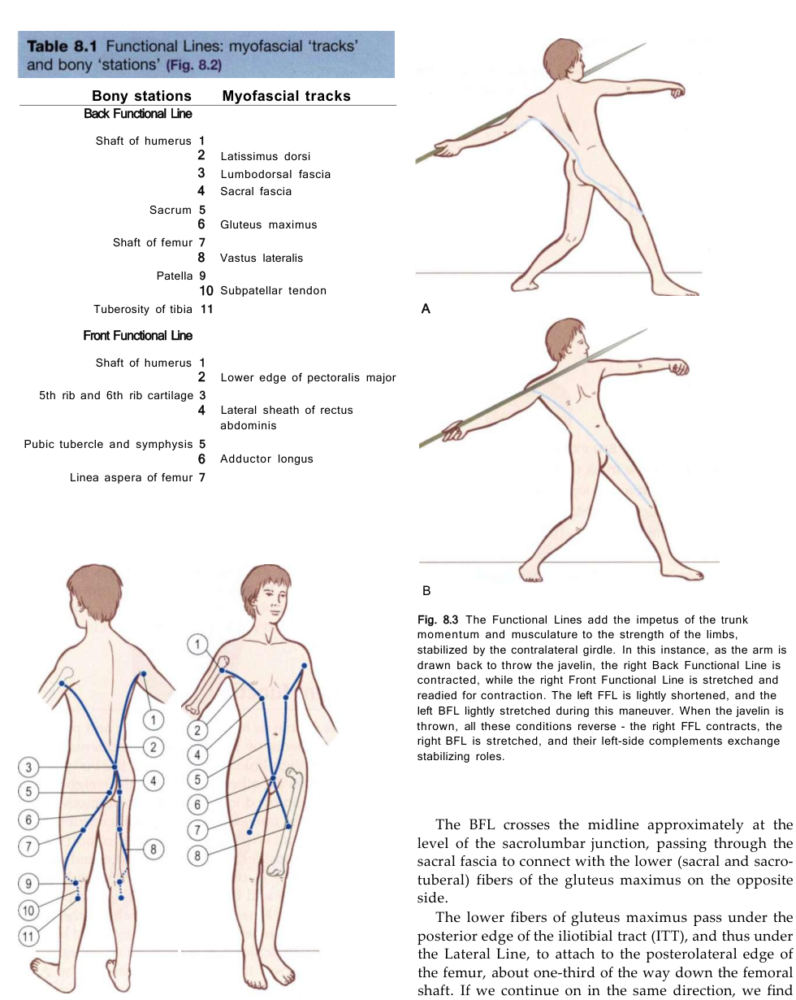

# Functional Lines

*Fig. 8.2 Functional Lines tracks and stations (Anatomy Trains, Thomas W. Myers).*

## Anatomy Trains Tracks & Bony Stations (Table 8.1)

### Back Functional Line (BFL)
| Level | Type | Anatomical Station / Myofascial Track |
|---|---|---|
| Shoulder / Arm | **Station** | Shaft of humerus |
| Shoulder / Upper Back | **Track** | [[latissimus_dorsi]] |
| Spine / Lower Back | **Track** | [[thoracolumbar_fascia]] / Sacral fascia |
| Pelvis / Sacrum | **Station** | Sacrum / Sacrolumbar junction |
| Hip / Pelvis | **Track** | Contralateral [[gluteus_maximus]] |
| Thigh / Lateral | **Station** | Shaft of femur / Linea aspera |
| Thigh / Anterior | **Track** | Vastus lateralis |
| Knee | **Station** | Patella / Tibial tuberosity (Subpatellar tendon) |

### Front Functional Line (FFL)
| Level | Type | Anatomical Station / Myofascial Track |
|---|---|---|
| Shoulder / Arm | **Station** | Shaft of humerus |
| Chest / Thorax | **Track** | [[pectoralis_major]] (lower border) -> 5th & 6th ribs |
| Abdomen | **Track** | Lateral [[rectus_abdominis]] sheath |
| Pelvis | **Station** | Pubic tubercle / Symphysis pubis |
| Thigh / Medial | **Track** | Contralateral [[adductor_longus]] |
| Femur | **Station** | Linea aspera of femur |

## Definition

The Functional Lines are Anatomy Trains pathways linking the limbs across or along the trunk. The family includes the [[back_functional_line]], [[front_functional_line]], and [[ipsilateral_functional_line]].

## Why It Matters

These lines provide the vault's primary anatomical bridge between measured external mechanics and structures spanning the hip, sacrum, trunk, rib cage, scapula, and shoulder. This bridge is an anatomical interpretation, not a claim that the lines generate, convert, or directly reveal external moments.

## Stable Anatomy (Level 1 & 2)

- [[back_functional_line]]: [[latissimus_dorsi]] -> [[thoracolumbar_fascia]] across the sacral region -> contralateral [[gluteus_maximus]] -> vastus lateralis.
- [[front_functional_line]]: [[pectoralis_major]] -> [[rectus_abdominis|abdominal wall and rectus sheath]] -> contralateral [[adductor_longus]].
- [[ipsilateral_functional_line]]: [[latissimus_dorsi]] -> [[external_oblique]] -> ipsilateral [[sartorius]].

These are Level 1 Anatomy Trains structural continuities. They do not, by themselves, establish tissue loading, muscle activation, energy storage, or a kinetic contribution in a golf swing.

## Golf Application Interpretation (Level 3 & 4 context)

Kwon describes the external mechanics; the following line mapping is the vault's Anatomy Trains-based golf interpretation.

The external-to-anatomical traversal is:

[[ground_reaction_force|measured GRF]] + [[moment_arm]] + [[center_of_mass|COM]] -> GRF moment about COM -> hip/sacrum -> [[thoracolumbar_fascia]] -> [[back_functional_line]] -> rib cage/scapula/[[shoulder_joint]].

Separate traversals are adductors/abdominal wall -> [[front_functional_line]] and ipsilateral trunk/hip linkage -> [[ipsilateral_functional_line]]. At the upper end, rib cage/scapula/[[shoulder_joint|shoulder]] -> relevant Functional and Arm Lines links the trunk model to the upper limb. Direct/residual [[ground_reaction_moment|GRM]] remains a force-plate moment at COP; it is not the GRF moment about COM and is not converted by a fascial line.

| Swing phase | External/mechanical context | Anatomical bridge | Line role | Evidence boundary |
|---|---|---|---|---|
| [[shaft_parallel_to_end_pelvis_rotation]] | EPR can anchor timing; any GRF moment about COM requires measured GRF and 3-D moment-arm geometry. | Hip/sacrum -> [[thoracolumbar_fascia]] and adductors/abdominal wall -> Functional Lines | loading | Level 3 external context; line role is a vault interpretation. |
| [[end_pelvis_rotation_to_top_backswing]] | No universal force or moment direction is assigned to this interval. | Pelvis/trunk -> posterior, anterior, and ipsilateral pathways | loading | Level 1 structure plus Level 3/4 context; tissue state is unknown. |
| [[golf_swing_transition]] | Instrumented forces and moments may be analysed over declared event bounds. | Hip/sacrum and abdominal wall -> Functional Lines -> rib cage/scapula/shoulder | stabilising | Kwon does not establish line loading or muscle activation. |
| [[max_unweighting_to_impact]] | BI is a timing anchor; external kinetics require compatible sensors. | Trunk pathways -> shoulder girdle and relevant Arm Lines | releasing/decelerating | Phase role is interpretive, not a measured energy-release claim. |
| [[impact_to_hands_chest_height]] | Post-impact impulse analysis requires measured force/moment and declared bounds. | Rib cage/scapula/shoulder -> Functional and Arm Lines | releasing/decelerating | Deceleration role and tissue loading remain unmeasured. |

## App Hypotheses (Level 5)

Ordinary video may yield pelvis/thorax orientation, phase timing, and shoulder-to-contralateral-hip diagonal-distance descriptors when landmarks and view permit. A shoulder-to-hip value is a **camera-derived diagonal-distance descriptor; tissue loading remains unknown**. It is not a direct measure of fascial stretch, force, activation, elastic energy, GRF, GRM, COP, or a GRF moment about COM.

Any Functional Line Loading Index must therefore be labelled a Level 5 hypothesis and report view, landmark, and confidence limits. It must not diagnose weakness, restriction, or injury.

## Squat Role (Engine Synthesis, Level 5)

In loaded, asymmetric, or single-leg squat variants, [[functional_lines]] act as the primary **cross-body dynamic force transfer slings**. They link upper body bar loading and shoulder orientation to the contralateral pelvis and hip extensor engine via the thoracolumbar fascia and adductor-pubic complex.

See [[squat_switch_failure_modes]] and [[squat_myofascial_mapping]] for the complete 21-misalignment taxonomy and evidence boundaries.

### Functional Lines Dynamic Switches & Misalignment Matrix

| Line | Misalignment Pattern | Bony Station | Associated Switch Failure Mode | Express vs. Local Dynamics | Retest Protocol |
|---|---|---|---|---|---|
| [[back_functional_line]] | **Pelvic Rotation / Asymmetrical Ascent** | Thoracolumbar Fascia / Ischial Tuberosity | Cross-Torso Sling Switch Failure | Latissimus Dorsi & Contralateral Gluteus Maximus (Express BFL) fail to synchronize torque across sacrum. | Retest with symmetrical barbell placement and single-leg hip extension assessment. |
| [[front_functional_line]] | **Thoracic Kyphosis / Chest Collapse** | Pubic Symphysis / 5th Rib | Anterior Cross-Sling Collapse | Pectoralis Major & Contralateral Adductor Longus (Express FFL) pull chest forward under front load. | Cue "chest up / elbows high" in goblet or front squat setup. |
| [[ipsilateral_functional_line]] | **Pelvic Shift / Lateral Sway** | Iliac Crest / Greater Trochanter | Ipsilateral Lateral Line Lock | Same-side Latissimus Dorsi & External Oblique (Express IFL) substitute for weak stance Gluteus Medius (Local LL). | Perform supported split squat to isolate same-side trunk-to-hip stability. |

*This is a candidate assessment hypothesis, not a tissue diagnosis. Camera data describes 2D/3D image-plane orientation and timing; it does not measure fascial tension, force transmission, or muscle activation.*

## Rotational Dissociation Interpretation (2026-07-27)

For rotational sports such as golf, the Functional Lines — with their contralateral pelvis-trunk-shoulder pathways — are the primary anatomy through which pelvis-thorax dissociation ([[x_factor]]) and the golf [[stretch_shortening_cycle]] are *cautiously* interpreted. A smoothly created, well-timed, smoothly released dissociation **may be consistent with** elastic load sharing along these lines; per [[myofascial_interpretive_layer]] this is always a labelled interpretation, never a measured fascial-force, stiffness, or energy-storage claim.

## Relationships

| Relationship | Target | Description |
|---|---|---|
| contains | [[back_functional_line]] | Posterior contralateral pathway through the thoracolumbar fascia. |
| contains | [[front_functional_line]] | Anterior contralateral pathway through the abdominal wall and adductors. |
| contains | [[ipsilateral_functional_line]] | Same-side trunk-to-hip pathway. |
| interprets | [[golfer_ground_interaction_model]] | Adds a separately labelled anatomical bridge to external mechanics. |
| relevant_to | [[ground_reaction_moment]] | Keeps direct/residual GRM at COP distinct from line interpretation. |

## Open Questions

- Which phase-role assignments can be tested with synchronised motion capture, force plates, and independent tissue measures?
- How reliable are diagonal-distance descriptors across camera views and landmark occlusion?
