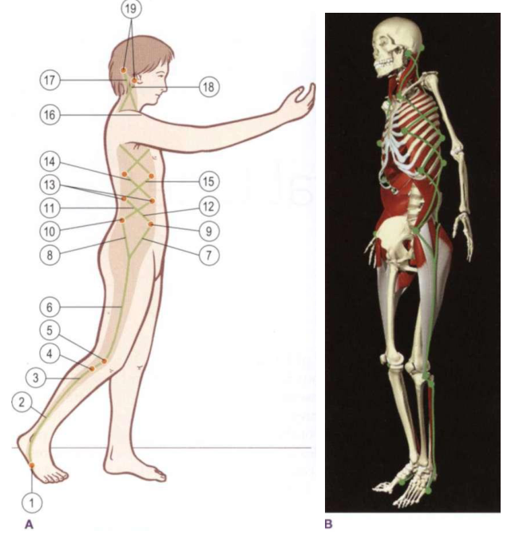

# Lateral Line

*Fig. 5.2 Lateral Line tracks and stations (Anatomy Trains, Thomas W. Myers).*

## Anatomy Trains Tracks & Bony Stations (Table 5.1)

| Level | Type | Anatomical Station / Myofascial Track |
|---|---|---|
| Cranium | **Station** | Occipital ridge / Mastoid process |
| Neck | **Track** | [[splenius_capitis]] / [[sternocleidomastoid]] |
| Rib Cage | **Station** | Ribs (1st to 12th) |
| Thorax / Abdomen | **Track** | [[intercostals]], [[external_oblique]], [[internal_oblique]] |
| Pelvis | **Station** | Iliac crest, ASIS, PSIS |
| Hip / Thigh | **Track** | [[tensor_fasciae_latae]], [[gluteus_maximus]], [[iliotibial_tract]] |
| Knee | **Station** | Fibular head, lateral condyle of tibia |
| Lower Leg | **Track** | [[peroneus_longus]] and peroneus brevis, Lateral compartment |
| Foot | **Station** | Base of 1st and 5th metatarsals |

## Definition

The Lateral Line is an Anatomy Trains model of continuity along the outer foot and leg, lateral pelvis, abdominal wall, ribs, and neck.

## Why It Matters

It provides a stable route for interpreting side-to-side organisation while avoiding causal claims from a visible sway or side-bend pattern.

## Stable Anatomy (Level 1 & 2)

The cited pathway includes [[peroneus_longus]] and peroneus brevis, lateral knee tissues, iliotibial tract and tensor fasciae latae, gluteal region, abdominal obliques, intercostals, and lateral neck structures. Structural membership does not establish a golf-phase braking or stabilising action.

## Golf Application Interpretation (Level 3 & 4 context)

Kwon describes the external mechanics; the following line mapping is the vault's Anatomy Trains-based golf interpretation.

The lower traversal is foot/ankle -> [[plantar_fascia]]/deep leg -> [[lateral_line]] through the fibularii/peroneals -> lateral hip/pelvis -> rib cage. Plantar fascia is an entry bridge in the vault graph, not direct Lateral Line membership. External mechanics may contextualise this route but do not identify tissue loading.

| Swing phase | External/mechanical context | Anatomical bridge | Line role | Evidence boundary |
|---|---|---|---|---|
| [[address_to_shaft_parallel]] | No phase-specific kinetic direction is assigned. | Foot/ankle -> lateral leg -> pelvis/ribs | stabilising | Line role is interpretive; pressure and tension are unknown. |
| [[shaft_parallel_to_end_pelvis_rotation]] | GRF moment about COM requires measured force and 3-D geometry. | Lateral foot/leg -> hip/pelvis -> oblique trunk | stabilising | Kwon does not establish Lateral Line loading. |
| [[golf_swing_transition]] | External kinetics require compatible instruments. | Foot/ankle -> lateral hip -> rib cage | loading | Tissue loading and activation remain unknown. |
| [[max_unweighting_to_impact]] | BI supplies a timing anchor only. | Lateral pelvis/trunk pathway | releasing/decelerating | Deceleration role is not a direct tissue measure. |

## App Hypotheses (Level 5)

Camera-derived observations may include pelvis translation, trunk side bend, foot orientation, and phase timing. They cannot measure COP, pressure, force, moments, muscle activation, fascial tension, Lateral Line loading, or energy storage, transfer, release, or dissipation. A lateral-shift descriptor must not be reported as proof of tissue weakness, restriction, or pain source.

## Gait Role (Engine Synthesis, Level C)

See [[gait_myofascial_mapping]] for the full synthesis. Summary for this line:

- **Phase role:** Frontal-plane stability. Prevents the weighted hip from falling inward (adduction). Has the most range to travel and the most adjustment work in gait. The X-fibre pattern of the lateral obliques controls the rotational relationship between pelvis and rib cage. Active throughout stance, especially managing pelvic tilt/shift.
- **Restriction pattern:** Short LL → restricted **hip internal rotation** (in gait, with ITB tightness), restricted frontal-plane pelvic control. Often co-occurs with foot over-pronation.
- **Compensation signature when restricted:** Trendelenburg sign, lateral trunk lean over the stance leg — compensating via [[spiral_line]] (rotational) and [[deep_front_line]] (core brace).
- **Best observed from:** **front + back views** (frontal-plane pelvic level and lateral trunk lean are visible from both; side view is blind to LL frontal-plane findings). Back view adds glute med / TFL / ITB asymmetry.
- **Spine in gait:** LL crosses the thoracic spine via intercostals/lateral obliques and the lumbar spine via lateral obliques. Restricted **thoracic lateral flexion** (asymmetric shoulder height) and restricted **lumbar rotation** (LL obliques, pelvis and shoulders rotate together) are LL restriction patterns. The LL X-fibre pattern controls the rotational relationship between pelvis and rib cage in gait. See [[gait_myofascial_mapping]].

All mappings are `engine_synthesis` (C); not measured kinetics or causal proof. The **phase role** is directly supported by the source (Myers/Earls Ch.10 line gait roles); the **restriction pattern** and **compensation signature** are engine synthesis from line anatomy + fascial-reciprocal logic, not enumerated in the source. The **spine in gait** patterns are independent local-segment patterns from line anatomy — the source supports elastic-recoil propagation, not spine-to-spine ROM propagation. See [[gait_myofascial_mapping]] Evidence boundary.

## Squat Role (Engine Synthesis, Level 5)

In the bodyweight squat, the [[lateral_line]] (LL) acts as the **frontal-plane stabilizing harness**. It controls lateral foot balance ([[peroneus_longus]]), femoral abduction/centration ([[gluteus_medius]], TFL/[[iliotibial_tract]]), lateral pelvic level, and lateral trunk stability ([[quadratus_lumborum]], intercostals).

See [[squat_switch_failure_modes]] and [[squat_myofascial_mapping]] for the complete 21-misalignment taxonomy and evidence boundaries.

### Lateral Line Dynamic Switches & Misalignment Matrix

| Misalignment Pattern | Bony Station | Associated Switch Failure Mode | Express vs. Local Dynamics | Retest Protocol |
|---|---|---|---|---|
| **Excessive Foot Supination / Rigid High Arch** | Cuboid / 5th Metatarsal Base | Lateral Line Eversion Switch Lock | Peroneus Longus (Express LL) locks foot in inversion, blocking Tibialis Posterior (Local DFL) ground adaptation. | Cue tripod foot grounding (pressing big toe joint into floor). |
| **Dynamic Knee Valgus** | Linea Aspera / Femoral Condyle | [[squat_switch_failure_modes#2-the-femoral-adductor-switch-dfl-anterior-vs-posterior-track\|Femoral Adductor Switch]] | Gluteus Medius (Local LL) inhibited; Tensor Fasciae Latae (Express LL) and Adductors (DFL) pull femur medially. | Place mini-band above knees; retest if active abduction clears inward path. |
| **Dynamic Knee Varus** | Gerdy's Tubercle / Fibular Head | Lateral Harness Switch Lock | Biceps Femoris long head (Express SBL) & TFL (Express LL) pull tibia into lateral rotation over DFL. | Squeeze foam roller between knees during descent to engage adductors. |
| **Pelvic Shift / Lateral Sway** | Greater Trochanter / PSIS | Unilateral Lateral Line Lock | Quadratus Lumborum (Express LL) hikes hip to compensate for weak stance Gluteus Medius (Local LL). | Perform supported split squat to isolate single-leg stability. |
| **Unlevel Hip Line / Asymmetrical Depth** | Iliac Crest / L1-L5 | Unilateral QL Side-Lock Switch | Quadratus Lumborum (Express LL) holds one iliac crest elevated against opposite Pelvic Floor (Local DFL). | Retest side-plank endurance and QL passive length. |
| **Trunk Lateral Flexion / Side Bending** | 12th Rib / Iliac Crest | Lateral Line Unilateral Shortening | Intercostals/QL (Express LL) substitute for lack of bilateral intra-abdominal pressure. | Perform suitcase carry retest to evaluate frontal core stability. |

*This is a candidate assessment hypothesis, not a tissue diagnosis. Camera data describes 2D/3D image-plane orientation and timing; it does not measure fascial tension, force transmission, or muscle activation.*

## Relationships

- contains -> [[peroneus_longus]], [[iliotibial_tract]], [[gluteus_medius]], [[external_oblique]], [[intercostals]]
- connects_to -> [[ankle_joint]], [[hip_joint]], rib cage
- interpreted_during -> [[golf_swing_transition]]
- gait_synthesis -> [[gait_myofascial_mapping]]
- supported_by -> [[anatomy_trains_myofascial_thomas_w_myers]], [[julie_hammond_breakout]]

## Open Questions

- How should camera view alter confidence in pelvis-translation and side-bend descriptors?
