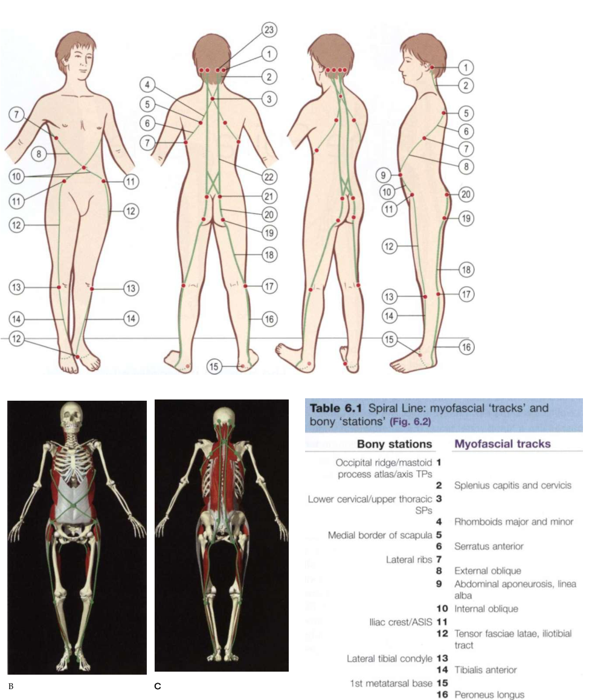

# Spiral Line

*Fig. 6.2 Spiral Line tracks and stations (Anatomy Trains, Thomas W. Myers).*

## Anatomy Trains Tracks & Bony Stations (Table 6.1)

| Level | Type | Anatomical Station / Myofascial Track |
|---|---|---|
| Cranium | **Station** | Occipital ridge / Temporal bone |
| Neck | **Track** | [[splenius_capitis]] and splenius cervicis |
| Spine | **Station** | Spinous processes (C6-T5) |
| Scapula / Shoulder Girdle | **Track** | [[rhomboids]] -> Medial scapula -> [[serratus_anterior]] |
| Rib Cage | **Station** | Lateral ribs |
| Abdomen | **Track** | [[external_oblique]] -> Abdominal raphe -> Contralateral [[internal_oblique]] |
| Pelvis | **Station** | Iliac crest / ASIS |
| Thigh / Lateral | **Track** | [[tensor_fasciae_latae]], [[iliotibial_tract]] |
| Knee | **Station** | Lateral condyle of tibia |
| Lower Leg / Foot | **Track** | [[tibialis_anterior]] -> 1st Metatarsal -> [[peroneus_longus]] -> Fibular head |
| Pelvis | **Station** | Ischial tuberosity |
| Thigh / Posterior | **Track** | [[biceps_femoris_long_head]] -> [[sacrotuberous_ligament]] -> Sacrum -> Erector spinae ([[spinalis]], [[longissimus]], [[iliocostalis]]) |
| Cranium | **Station** | Occipital ridge |

## Definition

The Spiral Line is an Anatomy Trains model of diagonal continuity around the body, linking parts of the foot and leg with the pelvis, trunk, scapula, and neck.

## Why It Matters

It is the vault's anatomical bridge for rotational organisation across multiple regions, while leaving the direction and magnitude of external kinetics to instrumented measurement.

## Stable Anatomy (Level 1 & 2)

The cited Anatomy Trains pathway includes [[tibialis_anterior]], [[peroneus_longus]], iliotibial tract and tensor fasciae latae, hamstring/sacrotuberous elements, abdominal obliques, [[serratus_anterior]], [[rhomboids]], and posterior neck structures. Myers supports membership in the line model; it does not establish golf-phase tissue loading.

## Golf Application Interpretation (Level 3 & 4 context)

Kwon describes the external mechanics; the following line mapping is the vault's Anatomy Trains-based golf interpretation.

The lower bridge is foot/ankle -> [[plantar_fascia]]/deep leg -> [[spiral_line]] -> hip/pelvis -> abdominal wall -> rib cage/scapula/[[shoulder_joint]]. Plantar fascia is an entry structure in the vault traversal, not asserted here as direct Spiral Line membership. The upper bridge connects the serratus-rhomboid scapular route to relevant Functional and Arm Lines.

| Swing phase | External/mechanical context | Anatomical bridge | Line role | Evidence boundary |
|---|---|---|---|---|
| [[shaft_parallel_to_end_pelvis_rotation]] | Any GRF moment about COM requires measured GRF and moment-arm geometry. | Foot/ankle -> deep leg -> hip/pelvis -> oblique trunk | stabilising | External context is Level 3; line role is interpreted. |
| [[end_pelvis_rotation_to_top_backswing]] | No universal force or moment direction is assigned. | Pelvis/obliques -> rib cage/scapula | loading | Tissue tension and energy storage are unknown. |
| [[golf_swing_transition]] | Instrumented kinetics may be analysed over declared events. | Foot/ankle -> Spiral Line -> trunk/scapula | stabilising | Kwon does not establish Spiral Line loading. |
| [[max_unweighting_to_impact]] | BI is a supported timing anchor, not a tissue-state measure. | Trunk/scapula -> shoulder and Arm Lines | releasing/decelerating | Phase role is a vault interpretation only. |

## App Hypotheses (Level 5)

Ordinary video may describe foot orientation, pelvis/thorax orientation, phase timing, and shoulder/scapular landmark trajectories when visible. It cannot measure GRF, moments, impulse, muscle activation, fascial tension, line loading, or energy. A rotational-chain score must remain Level 5 and must not diagnose a restriction.

## Gait Role (Engine Synthesis, Level C)

See [[gait_myofascial_mapping]] for the full synthesis. Summary for this line:

- **Phase role:** **Especially significant line in gait** (Earls: "walking is very much a movement derived from rotational forces"). Decelerates pronation + hip flexion + tibial internal rotation at heel strike via the tibialis anterior → ITB → upper gluteus maximus sling. Anterior SPL assists foot re-supination before toe-off. Upper SPL (rhomboids/serratus/splenii) manages contralateral counter-rotation to keep eyes forward. Active across [[initial_contact]], [[loading_response]], [[terminal_stance]], [[preswing]].
- **Restriction pattern:** Short SPL → restricted **hip internal rotation** (in gait), restricted **foot supination** before toe-off, restricted **trunk counter-rotation**. Clue it's SPL: passive sagittal ROM normal but gait-phase motion restricted.
- **Compensation signature when restricted:** excessive arm swing, eyes drift with pelvis, foot stays pronated, poor push-off — compensating via [[front_functional_line]] and [[lateral_line]].
- **Best observed from:** **front + back together** (SPL is the transverse-plane line and is the hardest to capture from any single view). Front view gives the upper SPL (shoulders vs pelvis counter-rotation) + foot pronation; back view gives the posterior SPL diagonal (glute → lat) + heel mechanics. A single side view will miss SPL restriction patterns even though SPL is "especially significant in gait."
- **Spine in gait:** SPL crosses the cervical spine via splenii, the thoracic spine via rhomboids/serratus/spinalis, and the lumbar spine via obliques. Restricted **neck rotation** (cervical, eyes drift with pelvis), restricted **thoracic rotation** (excessive arm swing, motion exported outward), and restricted **lumbar rotation** (pelvis and shoulders rotate together) are SPL restriction patterns. The SPL is the primary line for the transverse-plane winding/unwinding of the torso in gait. See [[gait_myofascial_mapping]].

All mappings are `engine_synthesis` (C); not measured kinetics or causal proof. The **phase role** is directly supported by the source (Myers/Earls Ch.10 line gait roles); the **restriction pattern** and **compensation signature** are engine synthesis from line anatomy + fascial-reciprocal logic, not enumerated in the source. The **spine in gait** patterns are independent local-segment patterns from line anatomy — the source supports elastic-recoil propagation, not spine-to-spine ROM propagation. See [[gait_myofascial_mapping]] Evidence boundary.

## Relationships

- contains -> [[tibialis_anterior]], [[peroneus_longus]], [[external_oblique]], [[internal_oblique]], [[serratus_anterior]], [[rhomboids]]
- connects_to -> [[plantar_fascia]], [[ankle_joint]], [[hip_joint]], rib cage, [[shoulder_joint]]
- interpreted_during -> [[golf_swing_transition]]
- gait_synthesis -> [[gait_myofascial_mapping]]
- supported_by -> [[anatomy_trains_myofascial_thomas_w_myers]]

## Open Questions

- Which lower-limb and scapular descriptors are robust enough for multi-view validation?
