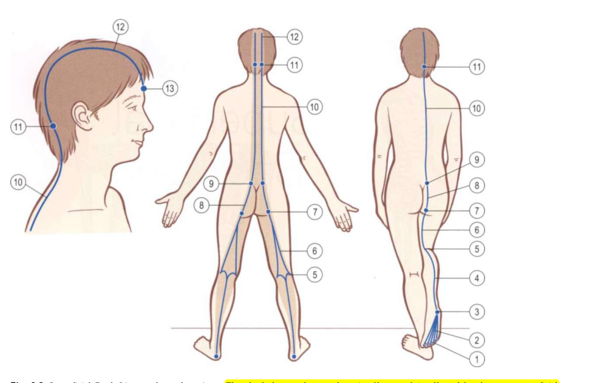

# Superficial Back Line

*Fig. 3.2 Superficial Back Line tracks and stations (Anatomy Trains, Thomas W. Myers).*

## Anatomy Trains Tracks & Bony Stations (Table 3.1)

| Level | Type | Anatomical Station / Myofascial Track |
|---|---|---|
| Head / Cranium | **Station** | Frontal bone, supraorbital ridge |
| Head / Scalp | **Track** | Galea aponeurotica / Epicranial fascia |
| Cranium / Neck | **Station** | Occipital ridge |
| Spine / Trunk | **Track** | Thoracolumbar fascia / Erector spinae ([[spinalis]], [[longissimus]], [[iliocostalis]]) |
| Pelvis | **Station** | Sacrum |
| Pelvis / Hip | **Track** | [[sacrotuberous_ligament]] |
| Pelvis | **Station** | Ischial tuberosity |
| Thigh / Posterior | **Track** | Hamstrings ([[biceps_femoris_long_head]], [[semitendinosus]], [[semimembranosus]]) |
| Knee | **Station** | Condyles of femur |
| Lower Leg | **Track** | [[gastrocnemius]] / [[soleus]] / Achilles tendon |
| Heel | **Station** | Calcaneus (plantar and posterior surface) |
| Foot | **Track** | [[plantar_fascia]] and short toe flexors |
| Toes | **Station** | Plantar surface of toe phalanges |

## Definition

The Superficial Back Line is an Anatomy Trains model of posterior continuity from plantar foot structures through the calf, posterior thigh, sacral connection, spinal extensors, and head.

## Why It Matters

It provides a posterior anatomical bridge from foot/ankle toward the pelvis and trunk while keeping posture and camera appearance separate from tissue state.

## Stable Anatomy (Level 1 & 2)

The cited pathway includes [[plantar_fascia]], [[gastrocnemius]], [[soleus]], hamstrings, [[sacrotuberous_ligament]], spinal extensors, [[nuchal_ligament]], and scalp structures. Line membership does not establish posterior-chain load, activation, or energy storage during golf.

## Golf Application Interpretation (Level 3 & 4 context)

Kwon describes the external mechanics; the following line mapping is the vault's Anatomy Trains-based golf interpretation.

The explicit route is foot/ankle -> [[plantar_fascia]]/deep leg -> [[superficial_back_line]] -> calf/hamstrings -> sacrum -> spinal extensors. External forces and moments may contextualise the swing phase but do not prove load travelling through this route.

| Swing phase | External/mechanical context | Anatomical bridge | Line role | Evidence boundary |
|---|---|---|---|---|
| [[address_to_shaft_parallel]] | No phase-specific force direction is assigned. | Foot/ankle -> plantar fascia -> calf/posterior thigh | stabilising | Role is a vault interpretation; loading is unknown. |
| [[end_pelvis_rotation_to_top_backswing]] | EPR and TB provide timing anchors. | Posterior thigh/sacrum -> spinal extensors | loading | No direct measure of fascial stretch or energy storage. |
| [[golf_swing_transition]] | Instrumented kinetics may contextualise transition. | Plantar foot -> posterior leg -> sacrum/trunk | stabilising | Kwon does not establish SBL loading. |
| [[impact_to_hands_chest_height]] | Post-impact impulse requires measured force/moment and event bounds. | Posterior trunk and lower-limb route | releasing/decelerating | Deceleration role remains interpretive. |

## App Hypotheses (Level 5)

Camera data may describe ankle, knee, hip, trunk, and head landmarks plus phase timing. It cannot measure foot pressure, GRF, moments, muscle activation, fascial tension, SBL loading, or energy. Co-occurring foot, spinal, neck, or jaw descriptors must not be interpreted as a diagnosis or single tissue cause.

## Gait Role (Engine Synthesis, Level C)

See [[gait_myofascial_mapping]] for the full synthesis. Summary for this line:

- **Phase role:** Drives stance — hip extension + plantarflexion from heel strike through foot roll-over. Plantarflexors of the SBL **plus LL and DFL** load the "catapult" for toe-off (Earls — catapult is multi-line, not SBL-only). Active across [[loading_response]], [[mid_stance]], [[terminal_stance]], and [[preswing]].
- **Restriction pattern:** Short SBL → restricted **knee extension** (SBL crosses posterior knee via hamstrings/gastrocnemius), restricted **hip flexion**, restricted **ankle dorsiflexion** (gastroc/soleus must lengthen).
- **Compensation signature when restricted:** flat-footed push-off, forward lean, reduced propulsion — compensating via [[deep_front_line]] (psoas over-pull), [[superficial_front_line]] (anterior drag).
- **Best observed from:** **side view** (hip extension, plantarflexion, heel rise, toe-off, and the four foot rockers are sagittal-plane findings). Back view adds calf/hamstring symmetry; front view is largely blind to SBL sagittal mechanics.
- **Spine in gait:** SBL crosses the cervical spine via nuchal ligament/suboccipitals and the thoracic/lumbar spine via erector spinae. Three **independent** SBL restriction patterns (each caused by SBL shortness at that segment's point on the line, not by one causing the other): (1) restricted **neck flexion** (can't tuck the chin, SBL posterior neck tightness at the cervical point); (2) restricted **thoracic flexion** (SBL erector spinae crosses the posterior thoracic spine; short SBL resists thoracic flexion, holding the thorax extended — NOT restricted thoracic extension, which is an SFL/DFL pattern); (3) restricted **lumbar flexion** (stuck in extension, SBL lumbar erector spinae tightness at the lumbar point). These are local-segment patterns from SBL anatomy; the source does not establish SBL transmits ROM restrictions segment-to-segment. See [[gait_myofascial_mapping]] Whole-chain insight for the evidence boundary.

All mappings are `engine_synthesis` (C); not measured kinetics or causal proof. The **phase role** is directly supported by the source (Myers/Earls Ch.10 line gait roles); the **restriction pattern** and **compensation signature** are engine synthesis from line anatomy + fascial-reciprocal logic, not enumerated in the source. The **spine in gait** patterns are independent local-segment patterns from line anatomy — the source supports elastic-recoil propagation, not spine-to-spine ROM propagation. See [[gait_myofascial_mapping]] Evidence boundary.

## Squat Role (Engine Synthesis, Level 5)

In the bodyweight squat, the [[superficial_back_line]] (SBL) acts as the **posterior guy-wire and eccentric braking system**. It controls ankle dorsiflexion, knee flexion derailment, hip extension, and posterior trunk stabilization.

See [[squat_switch_failure_modes]] and [[squat_myofascial_mapping]] for the complete 21-misalignment taxonomy and evidence boundaries.

### Superficial Back Line Dynamic Switches & Misalignment Matrix

| Misalignment Pattern | Bony Station | Associated Switch Failure Mode | Express vs. Local Dynamics | Retest Protocol |
|---|---|---|---|---|
| **Early Heel Lift** | Calcaneus (Heel Anchor) | [[squat_switch_failure_modes#1-the-knee-switch-sbl-gastrocnemius-hamstring-derailment\|Knee Switch]] / [[squat_switch_failure_modes#5-the-calcaneal-station-elevation-switch-sbl-dfl-ankle-block\|Calcaneal Station Switch]] | Soleus (Local SBL) tightness limits talar transit, forcing calcaneal station elevation to bypass ankle block. | Elevate heels on 20mm wedge. If depth normalizes, confirms distal calf block. |
| **Butt Wink (Posterior Pelvic Tilt at Depth)** | Ischial Tuberosity / Ramus | Adductor Magnus / Hamstring Length Switch | Biceps Femoris long head (Express SBL) reaches terminal length at deep flexion, tugging ischial tuberosity forward/down. | Widen stance 15% and externally rotate feet 10°. |
| **Restrained Knee Travel / Excessive Hip Hinge** | Calcaneus / Talus | Ankle Dorsiflexion Lockout Switch | Soleus (Local SBL) tightness blocks forward tibial travel, shifting 100% load to posterior hip hinge. | Elevate heels or measure passive ankle dorsiflexion off-load. |
| **Excessive Forward Trunk Lean** | Calcaneus / Lumbar Spine | Ankle-Trunk Coupling Switch | Thoracic Erectors (Express SBL) fail to overcome forward gravitational moment caused by blocked ankle. | Retest with goblet dumbbell held in front of chest. |
| **Forward Head Posture / Chin Jut** | Occipital Ridge / C1-C7 | Suboccipital Gaze Preservation Switch | Suboccipitals (Local SBL) locked short to keep gaze horizontal as trunk leans forward over weak DFL neck flexors. | Cue "double chin" / active neck retraction during squat descent. |

*This is a candidate assessment hypothesis, not a tissue diagnosis. Camera data describes 2D/3D image-plane orientation and timing; it does not measure fascial tension, force transmission, or muscle activation.*

## Relationships

- contains -> [[plantar_fascia]], [[gastrocnemius]], [[soleus]], [[sacrotuberous_ligament]], [[nuchal_ligament]]
- connects_to -> [[ankle_joint]], [[hip_joint]], [[thoracic_spine]]
- interpreted_during -> [[golf_swing_transition]]
- gait_synthesis -> [[gait_myofascial_mapping]]
- supported_by -> [[anatomy_trains_myofascial_thomas_w_myers]]

## Open Questions

- Which pose descriptors can be validated against instrumented posterior-chain measures without causal overreach?
