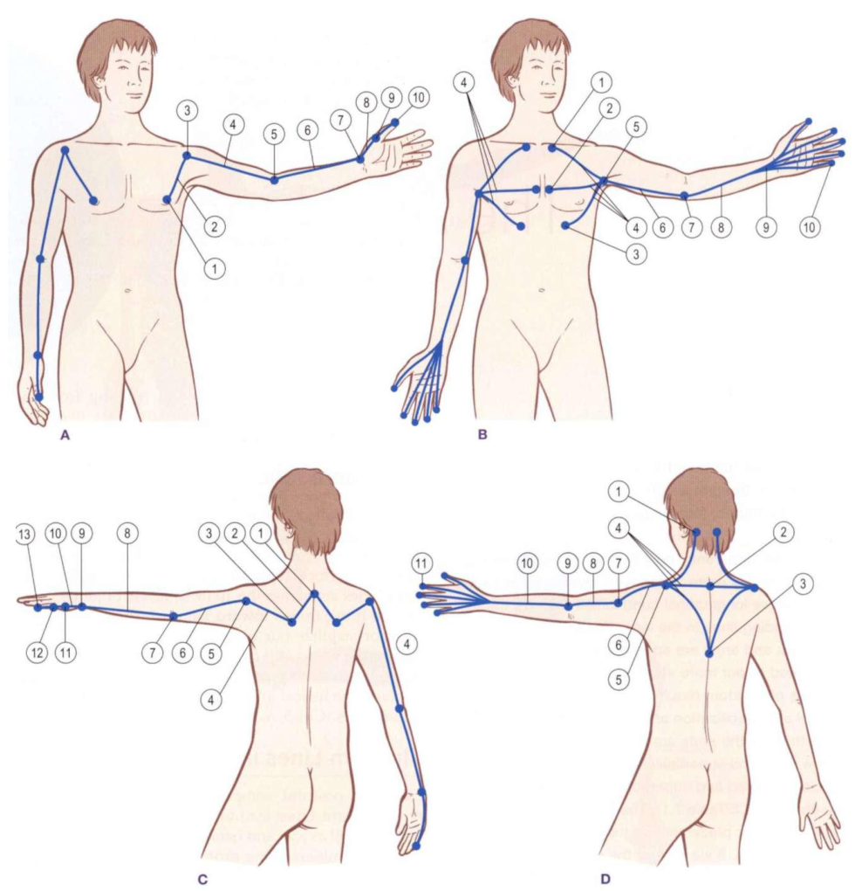

# Superficial Front Arm Line

*Fig. 7.2 Arm Lines tracks and stations (Anatomy Trains, Thomas W. Myers).*

## Anatomy Trains Tracks & Bony Stations (Table 7.1)

| Level | Type | Anatomical Station / Myofascial Track |
|---|---|---|
| Clavicle / Ribs | **Station** | Medial third of clavicle, costal cartilages, thoracolumbar fascia, iliac crest |
| Chest / Shoulder | **Track** | [[pectoralis_major]], [[latissimus_dorsi]] |
| Arm / Medial | **Station** | Medial humeral line / Medial intermuscular septum |
| Forearm / Anterior | **Track** | Forearm flexor group |
| Wrist / Hand | **Station** | Carpal tunnel / Palmar surface of hand and fingers |

## Definition

The Superficial Front Arm Line is an Anatomy Trains pathway from the anterior trunk and chest through the medial arm to the palmar surface of the hand.

## Why It Matters

It allows the vault to continue a trunk-to-upper-limb traversal beyond the Functional Lines while keeping line anatomy separate from golf kinetics.

## Stable Anatomy (Level 1 & 2)

The listed membership is a provisional legacy graph mapping whose exact Anatomy Trains locator has not been verified. The current node conservatively records [[pectoralis_major]] and [[latissimus_dorsi]] at the proximal route and crosses the [[shoulder_joint]] and [[elbow_joint]]; it is not settled Level 1 support. Distal membership should be expanded only after a precise source locator is added. The provisional mapping does not establish arm-line loading, activation, or club force.

## Golf Application Interpretation (Level 3 & 4 context)

Kwon describes the external mechanics; the following line mapping is the vault's Anatomy Trains-based golf interpretation.

The explicit upper-limb bridge is rib cage/scapula/[[shoulder_joint]] -> [[superficial_front_arm_line]] -> elbow and hand, with the proximal chest and latissimus connections linking back to relevant [[functional_lines]]. Kwon does not establish force transfer or tissue loading along this route.

| Swing phase | External/mechanical context | Anatomical bridge | Line role | Evidence boundary |
|---|---|---|---|---|
| [[end_pelvis_rotation_to_top_backswing]] | TB can anchor timing; no universal kinetic direction is assigned. | Rib cage/chest -> shoulder -> anterior arm | role uncertain | The bridge depends on provisional membership; tissue stretch is unknown. |
| [[golf_swing_transition]] | External kinetics require compatible instrumentation. | Functional Lines -> chest/shoulder -> arm | role uncertain | The bridge depends on provisional membership; Kwon does not establish SFAL loading or activation. |
| [[max_unweighting_to_impact]] | BI is a timing anchor, not a measure of arm-line force. | Shoulder -> elbow/hand route | role uncertain | Evidence is insufficient for a universal role. |
| [[impact_to_hands_chest_height]] | Post-impact impulse requires instrumented force/moment data. | Hand/elbow -> shoulder/chest pathway | role uncertain | Distal detail is unverified; tissue release and energy dissipation are unmeasured. |

## App Hypotheses (Level 5)

Camera data may describe shoulder, elbow, wrist, and hand positions, joint angles, and event timing when visible. These are kinematic descriptors only; ordinary video cannot measure club force, joint moment, muscle activation, fascial tension, arm-line loading, or energy. The app must not infer injury or treatment need from the descriptor.

## Squat Role (Engine Synthesis, Level 5)

In goblet squats and front squats, the [[superficial_front_arm_line]] (SFAL) links [[pectoralis_major]] and arm flexors to stabilize dumbbell / kettlebell load against the anterior chest wall.

See [[squat_switch_failure_modes]] and [[squat_myofascial_mapping]] for evidence boundaries.

### SFAL Dynamic Switches & Misalignment Matrix

| Misalignment Pattern | Bony Station | Associated Switch Failure Mode | Express vs. Local Dynamics | Retest Protocol |
|---|---|---|---|---|
| **Front Load Chest Dip / Flexion Shift** | Clavicle / Sternum / Bicipital Groove | Anterior Cross-Sling Collapse | Pectoralis Major (Express SFAL) pulls upper chest forward when anterior abdominal wall fails to counter-anchor. | Cue "elbows high / chest up" in front load setup. |

*This is a candidate assessment hypothesis, not a tissue diagnosis. Camera data describes 2D/3D image-plane orientation and timing; it does not measure fascial tension, force transmission, or muscle activation.*

## Relationships

- contains -> [[pectoralis_major]], [[latissimus_dorsi]]
- crosses -> [[shoulder_joint]], [[elbow_joint]]
- connects_to -> [[functional_lines]]
- candidate_source_pending_locator -> [[anatomy_trains_myofascial_thomas_w_myers]]

## Open Questions

- Add a source-located distal anatomy expansion before introducing hand-level structural claims.
