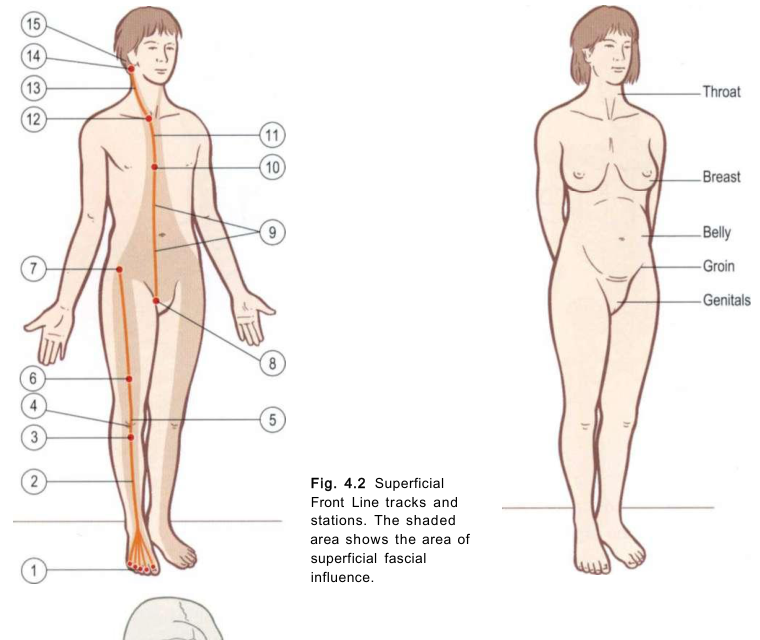

# Myofascial Line: Superficial Front Line (SFL)

*Fig. 4.2 Superficial Front Line tracks and stations (Anatomy Trains, Thomas W. Myers).*

## Anatomy Trains Tracks & Bony Stations (Table 4.1)

| Level | Type | Anatomical Station / Myofascial Track |
|---|---|---|
| Cranium | **Station** | Mastoid process, superior nuchal line |
| Neck / Throat | **Track** | [[sternocleidomastoid]], Sternochondral fascia |
| Thorax / Ribs | **Station** | 5th rib cartilage, sternum / Sternalis fascia |
| Abdomen | **Track** | [[rectus_abdominis]] |
| Pelvis | **Station** | Pubic tubercle |
| Pelvis / Hip | **Station** | Anterior Inferior Iliac Spine (AIIS) |
| Thigh / Anterior | **Track** | [[rectus_femoris]], Patellar tendon, Subpatellar tendon |
| Knee | **Station** | Tibial tuberosity |
| Lower Leg | **Track** | [[tibialis_anterior]], [[extensor_digitorum_longus]], [[extensor_hallucis_longus]] |
| Toes | **Station** | Dorsal surface of toe phalanges |

Connects the anterior surface of the body from toes to skull, acting as a postural counterbalance to the SBL.

## 🗺️ Anatomical Track (Individual Muscles)
The line runs sequentially through these myofascial tracks:
- [[tibialis_anterior]]
- [[extensor_digitorum_longus]]
- [[extensor_hallucis_longus]]
- [[rectus_femoris]]
- [[rectus_abdominis]]
- [[sternocleidomastoid]]

## ⚙️ Joint Crossings
This meridian directly spans and stabilizes the following joint structures:
- [[ankle_joint]]
- [[knee_joint]]
- [[hip_joint]]
- [[lumbar_spine]]
- [[thoracic_spine]]
- [[cervical_spine]]

## Squat Role (Engine Synthesis, Level 5)

In the bodyweight squat, the [[superficial_front_line]] (SFL) acts as the **anterior knee extension engine and abdominal pelvic wall anchor**. It links the anterior lower leg ([[tibialis_anterior]]) through the patellar tendon and quadriceps ([[rectus_femoris]]) up to the ASIS station and [[rectus_abdominis]].

See [[squat_switch_failure_modes]] and [[squat_myofascial_mapping]] for the complete 21-misalignment taxonomy and evidence boundaries.

### Superficial Front Line Dynamic Switches & Misalignment Matrix

| Misalignment Pattern | Bony Station | Associated Switch Failure Mode | Express vs. Local Dynamics | Retest Protocol |
|---|---|---|---|---|
| **Toe Elevation / Toe Clawing** | Distal Phalanges | Ankle Dorsiflexion Emergency Switch | Extensor Digitorum (Express SFL) over-recruited when Tibialis Anterior or Soleus is blocked. | Place coin under big toe pad; retest without lifting toe. |
| **Quad-Dominant Shear / Excessive Knee Advance** | Tibial Tuberosity / AIIS | Quadriceps Deceleration Switch Lock | Rectus Femoris (Express SFL) dominates deceleration; Vastus Medialis/Lateralis & Glutes under-utilized. | Perform box squat / sit-back cueing to engage posterior chain. |
| **Anterior Pelvic Tilt ("Duck Butt")** | ASIS / AIIS / Lesser Trochanter | [[squat_switch_failure_modes#3-the-asis-anchor-switch-sfl-pelvic-station\|ASIS Station Anchor Switch]] | Psoas/Iliacus pull ASIS down because Rectus Abdominis (Express SFL) fails to anchor ASIS upward. | Cue "rib cage down" and active abdominal bracing prior to descent. |
| **Thoracic Kyphosis / Upper Back Collapse** | 3rd-5th Ribs / Coracoid Process | Thoracic Extension Switch Failure | Pectoralis Minor (Express SFL/AL) pulls thoracic spine into flexion against weak SBL extensors. | Cue "pull elbows down toward back pockets" during setup. |

*This is a candidate assessment hypothesis, not a tissue diagnosis. Camera data describes 2D/3D image-plane orientation and timing; it does not measure fascial tension, force transmission, or muscle activation.*

## Gait Role (Engine Synthesis, Level C)

See [[gait_myofascial_mapping]] for the full synthesis. Summary for this line:

- **Phase role:** Drives swing-phase limb advancement (hip flexion, knee extension, ankle/MTP dorsiflexion). Anterior tissues lengthen / elastically load as the body progresses over the planted foot; muscle action is often isometric per Earls' SSC framing (not eccentric). The elastic recoil of that pre-stretch assists hip flexion into swing (recoil assists hip flexion; it does NOT assist knee flexion — knee flexion in swing is active hamstring + popliteus (popliteus here is (C) general DFL anatomy, not Earls gait), not SFL recoil). Primary driver during [[initial_swing]] and [[midswing]]; loaded during [[preswing]] and [[terminal_stance]].
- **Restriction pattern:** Short SFL → restricted **knee flexion** (SFL is the knee extensor line; it must lengthen for flexion — short SFL holds the knee in extension) and restricted **hip extension** (rectus femoris is biarticular: when the hip extends in late stance, RF is stretched proximally and cannot yield further at the knee). This is the **primary line to investigate when a gait report shows restricted knee flexion**.
- **Compensation signature when restricted:** hip hike, circumduction, vaulting — compensating via [[lateral_line]] (hip hike), [[spiral_line]] (circumduction), [[superficial_back_line]] (vaulting). (Steppage gait is NOT an SFL-restriction compensation — steppage is the compensation for weak/inhibited dorsiflexors, i.e. the SFL *not* firing, the opposite problem.)
- **Counterintuitive note:** tight hamstrings (SBL) make knee flexion *easier*, not harder. If a gait report shows restricted knee flexion AND tight hamstrings, the SFL is still the primary suspect — the hamstring tightness is a co-find, not the cause.
- **Best observed from:** **side view** (sagittal knee-flexion angle is only cleanly visible from the side). Front and back views are blind to the SFL sagittal restriction pattern; a side-only report declaring "no SFL restriction" is valid, but a front/back-only report must declare SFL `unavailable_from_this_view`.
- **Spine in gait:** SFL crosses the cervical spine via SCM and the lumbar spine via rectus abdominis. Two **independent** SFL restriction patterns (each caused by SFL shortness at that segment's point on the line, not by one causing the other): (1) restricted **neck extension** (forward head / chin poke, SFL SCM shortness at the cervical point); (2) restricted **lumbar extension** (stuck in flexion, SFL rectus abdominis shortness at the lumbar point). Separately, the Earls box exercise (Ch.10) shows a forward head reduces the SFL/DFL **elastic recoil** distally — this is an elastic-loading effect, not a cervical-causes-lumbar-ROM effect. See [[gait_myofascial_mapping]] Whole-chain insight for the evidence boundary.

All mappings are `engine_synthesis` (C); not measured kinetics or causal proof. The **phase role** is directly supported by the source (Myers/Earls Ch.10 line gait roles); the **restriction pattern** and **compensation signature** are engine synthesis from line anatomy + fascial-reciprocal logic, not enumerated in the source. The **spine in gait** patterns are independent local-segment patterns from line anatomy — the source supports elastic-recoil propagation, not spine-to-spine ROM propagation. See [[gait_myofascial_mapping]] Evidence boundary.

---

## 📋 Related Concepts & Assessments
- For movement analysis, check the index: `[[index]]`.
- Gait synthesis: [[gait_myofascial_mapping]].
