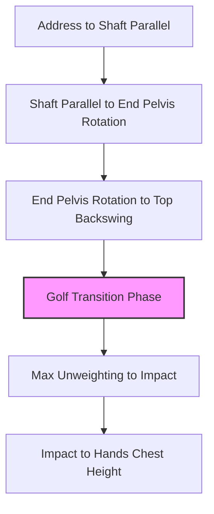

# Golf Swing

## Definition

The Golf Swing is a whole-body rotational sport movement that transfers force from ground contact through the body to the club.

## Why It Matters

It is the parent movement pattern for the golf phase graph. The swing should be reasoned through [[movement_sequencing]], [[force_transmission]], and [[energy_transfer]], not isolated muscle action.

## Supporting Evidence From Source

The [[golf_decoded_six_phases_swing]] screenshot defines six swing intervals from Address through Hands Chest Height.

## Kwon Event Crosswalk

The six vault phases remain the Level 4 intervals defined by [[golf_decoded_six_phases_swing]]. This table crosswalks boundary events only; it does not replace those phases with Kwon's research phases. A Kwon label is used only where the operational event is supported by [[dr_kwon_golfer_ground_interaction]].

| Vault boundary event | Kwon terminology | Crosswalk status |
| :--- | :--- | :--- |
| [[address_position|Address]] | not yet mapped | The vault position and Kwon's beginning events have not been shown to use the same operational definition. |
| [[shaft_parallel_position|Shaft Parallel]] | not yet mapped | No supported equivalence has been established. |
| [[end_pelvis_rotation|End Pelvis Rotation]] | EPR | Supported event match; Kwon also uses EPR to begin the extended downswing, without changing the vault's phase boundary. |
| [[top_backswing_position|Top Backswing]] | TB | Supported event match. |
| [[max_unweighting|Max Unweighting]] | not yet mapped | This source-defined vault event is not established as a Kwon event. |
| [[impact_position|Impact]] | BI (ball impact) | Supported event match. |
| [[hands_chest_height_position|Hands Chest Height]] | not yet mapped | It must not be substituted for Kwon's MF or LF events without matching definitions. |

## Relationship Table

| Relationship | Target |
|---|---|
| contains | [[address_to_shaft_parallel]] |
| contains | [[shaft_parallel_to_end_pelvis_rotation]] |
| contains | [[end_pelvis_rotation_to_top_backswing]] |
| contains | [[golf_swing_transition]] |
| contains | [[max_unweighting_to_impact]] |
| contains | [[impact_to_hands_chest_height]] |
| connects_to | [[movement_sequencing]] |
| connects_to | [[force_transmission]] |
| connects_to | [[energy_transfer]] |
| connects_to | [[golfer_ground_interaction_model]] |
| supported_by | [[dr_kwon_golfer_ground_interaction]] |

## Related Concepts

- [[ground_reaction_force]]
- [[toe_loading]]
- [[hip_internal_rotation]]
- [[thoracic_rotation]]
- [[trail_shoulder_external_rotation]]
- [[functional_lines]]
- [[spiral_line]]

## Parent Concepts

- [[golf]]

## Child Concepts

- [[address_to_shaft_parallel]]
- [[shaft_parallel_to_end_pelvis_rotation]]
- [[end_pelvis_rotation_to_top_backswing]]
- [[golf_swing_transition]]
- [[max_unweighting_to_impact]]
- [[impact_to_hands_chest_height]]

## Category

Golf
