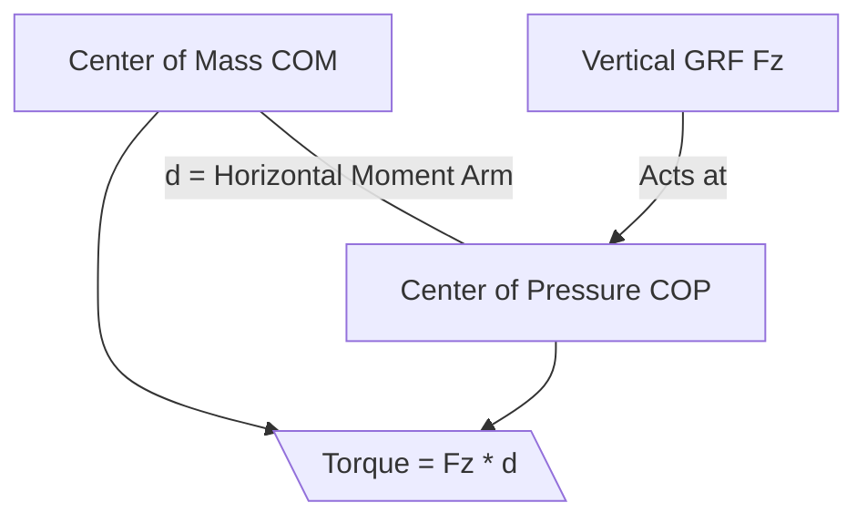
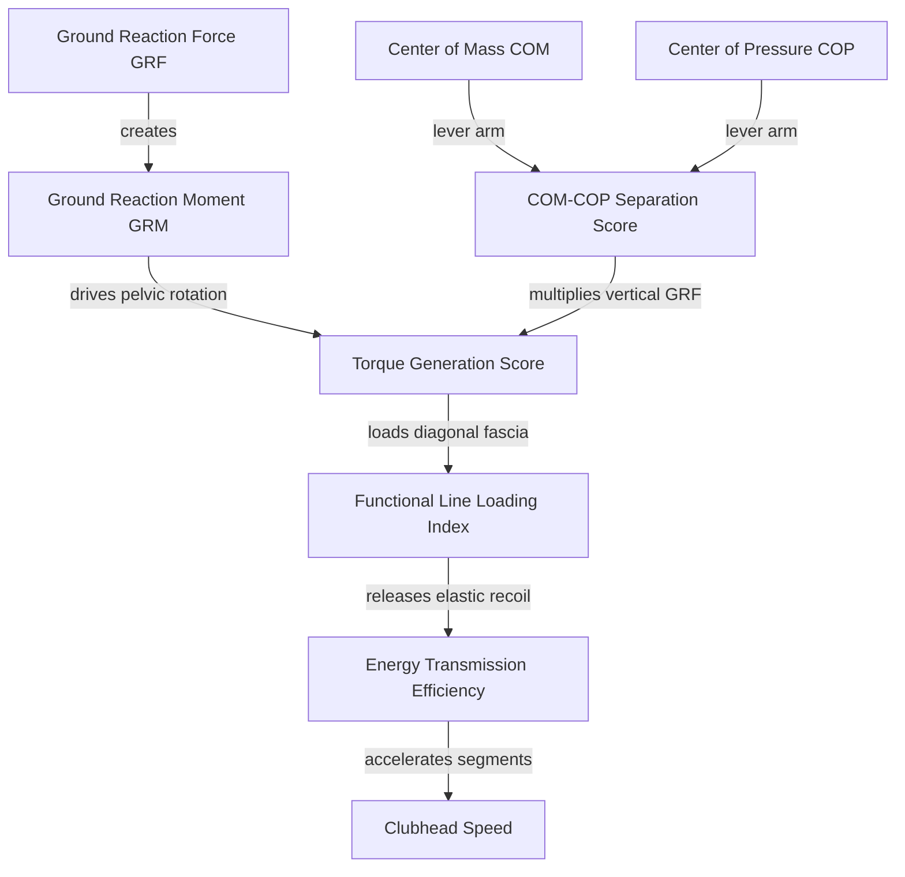

# AI Movement Analysis Layer

This specification defines the logical and mathematical frameworks for the future AI Movement Analysis layer. These metrics move beyond simple kinematic reports (such as reporting body joint angles) to explain **why** movement occurs, evaluating the efficiency of force generation, elastic loading, and energy transmission from first principles.

---

## 1. Torque Generation Score (TGS)

### Theoretical Basis
The Torque Generation Score measures the efficiency of converting ground reaction forces into rotational torque ($\tau_{\text{COM}}$) about the body's Center of Mass (COM). Rotational acceleration of the pelvis is driven by:

$$\tau_{\text{COM}} = M_{\text{frontal}} + M_{\text{sagittal}} + M_{\text{horizontal}} + T_{\text{pivoting}}$$

The score rates whether the golfer generates the peak vertical force ($F_z$) and horizontal shear force ($F_y$) at the correct phase intervals (transition to max unweighting) to maximize pelvic angular velocity.

### Required Measurements
- **Ideal Data (Level 3)**: Dual 3D force plates syncing vertical force ($F_z$), horizontal shear forces ($F_x, F_y$), and Center of Pressure (COP) pathways with high-speed 3D motion capture.
- **MediaPipe skeletal proxies (Level 5)**: 
  - **Lead Knee Flexion-Extension Velocity**: Rapid lead knee extension serves as a proxy for the vertical push-off rate ($F_z$).
  - **Pelvic Axial Rotational Acceleration ($\alpha_{\text{pelvis}}$)**: Derived from the left-right hip line.

### Evidence & Validation Status
- **Biomechanical Grounding (Level 3)**: High. Dr. Kwon's golfer-ground interaction model mathematically proves that vertical forces generate the primary rotational moments about the COM during the downswing.
- **App Algorithm (Level 5)**: In progress. We hypothesize that kinematic indicators (knee extension and pelvic rotation) can estimate TGS within a $\pm 15\%$ margin of error compared to force plates.

### Key Limitations
- Cannot measure absolute ground force magnitude (Newtons) from video alone.
- Heavily affected by camera frame rates; a standard 30fps camera may miss the exact peak velocity point of the knee extension.

---

## 2. COM–COP Separation Score (CCS)

### Theoretical Basis
The COM–COP Separation Score measures the horizontal leverage arm ($r_{\text{lever}}$) between the body's Center of Mass (COM) projection on the ground and the Center of Pressure (COP). A larger lateral separation during the transition multiplies the torque generated by the vertical Ground Reaction Force ($F_z$):

$$\tau_{\text{vertical}} = F_z \times d_{\text{COM-COP}}$$

If $d_{\text{COM-COP}}$ is too small (e.g., the golfer's pelvis slides too far target-ward, placing the COM directly over the lead foot), the moment arm shrinks to zero, and pushing down vertically generates no rotational torque.

### Required Measurements
- **Ideal Data (Level 3)**: Center of Mass 3D trajectory tracking and 3D force plate Center of Pressure coordinate paths.
- **MediaPipe skeletal proxies (Level 5)**:
  - **Horizontal separation distance**: The lateral distance between the pelvic center (proxy for S2/COM) and the lead ankle joint (proxy for the lead COP boundary) at the transition.
  - **Stance Width Ratio**: The separation distance normalized against the golfer's ankle-to-ankle stance width.

### Evidence & Validation Status
- **Biomechanical Grounding (Level 3)**: High. Classical physics and Dr. Kwon's moment calculations validate that COM-COP separation is the primary rotational moment arm.
- **App Algorithm (Level 5)**: Initial hypothesis. We define an optimal CCS threshold where the pelvic center is located at $35\% - 45\%$ of the stance width relative to the lead ankle during peak downswing loading.

### Key Limitations
- Parallax error: A camera angle that is not perfectly face-on (frontal plane) will distort the measured horizontal distance.
- Soft ground (turf) shifts the physical COP in ways that skeletal joints cannot reflect.

---

## 3. Functional Line Loading Index (FLLI)

### Theoretical Basis
The Functional Line Loading Index evaluates the timing, amplitude, and release of elastic tension in the Front, Back, and Ipsilateral Functional Lines. Fascial tissue behaves like a viscoelastic spring; stretching the cross-body sling (e.g., lead hip to trail shoulder) stores strain energy that is released during the recoil. FLLI rates:

$$\text{FLLI} = f(\text{Sling Stretch Distance}, \text{Rate of Stretch}, \text{Recoil Timing})$$

### Required Measurements
- **Ideal Data (Level 2)**: High-density surface EMG on the Latissimus Dorsi, contralateral Gluteus Maximus, Pectoralis Major, and contralateral Adductor Longus to measure muscle firing relative to joint stretching.
- **MediaPipe skeletal proxies (Level 5)**:
  - **Sling Length Proxy**: The geometric distance from the trail shoulder (acromion) to the lead hip (anterior superior iliac spine) for the Front Functional Line, and lead shoulder to trail hip for the Back Functional Line.
  - **Stretch Velocity**: The rate of change of this diagonal distance during Phase 4 (transition).

### Evidence & Validation Status
- **Biomechanical Grounding (Level 1 & 2)**: Moderate. Myers' Anatomy Trains defines the anatomical existence of these slings. Sports science literature validates the stretch-shortening cycle in diagonal muscle slings.
- **App Algorithm (Level 5)**: Speculative hypothesis. FLLI uses the maximum diagonal separation change (stretch) normalized against spine length to evaluate dynamic loading.

### Key Limitations
- Muscle activation tone cannot be measured without EMG. The app must assume the fascia is active when the skeletal segments move apart.
- Clothing blocks accurate shoulder/pelvis landmark tracking, introducing coordinate noise.

---

## 4. Energy Transmission Efficiency (ETE)

### Theoretical Basis
Energy Transmission Efficiency evaluates the execution of the Kinematic Sequence, measuring how effectively rotational velocity and kinetic energy are transferred from the ground up through the segments to the club. It calculates the deceleration slope of the proximal segment relative to the acceleration slope of the distal segment:

$$\text{ETE} = \frac{\omega_{\text{thorax, peak}}}{\omega_{\text{pelvis, peak}}} \times \left(1 - \text{Timing Delay Deviation}\right)$$

A high ETE indicates clean proximal-to-distal sequencing with sharp segment deceleration, indicating no energy is "lost" or bled off.

### Required Measurements
- **Ideal Data (Level 3)**: 3D high-speed electromagnetic or optical joint sensors mapping segment angular velocities at 240Hz+.
- **MediaPipe skeletal proxies (Level 5)**:
  - **Segment Rotational Velocities**: Calculated from the rate of change of 2D/3D angles of the hip line, shoulder line, and lead arm line.

### Evidence & Validation Status
- **Biomechanical Grounding (Level 3)**: High. The kinematic sequence is a widely accepted biomechanical standard in golf research (TPI, Kwon).
- **App Algorithm (Level 5)**: High confidence. segment velocity tracking is kinematically observable.

### Key Limitations
- 30fps video has a temporal resolution of 33.3ms, which is too slow to capture the exact peaks of a sequence where delays are 20–40ms. A camera capture speed of at least 60fps (preferably 120fps or 240fps) is required for ETE validation.

---

## Summary of AI Metrics Architecture

