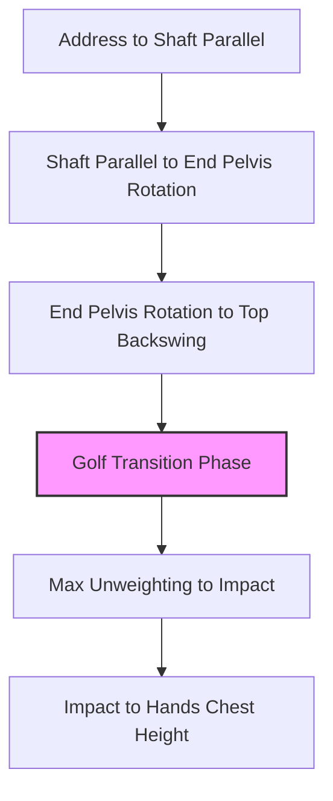

# Golf Swing

## Definition

The Golf Swing is a whole-body rotational sport movement that transfers force from ground contact through the body to the club.

## Why It Matters

It is the parent movement pattern for the golf phase graph. The swing should be reasoned through [[movement_sequencing]], [[force_transmission]], and [[energy_transfer]], not isolated muscle action.

## Supporting Evidence From Source

The [[golf_decoded_six_phases_swing]] screenshot defines six swing intervals from Address through Hands Chest Height.

## Relationship Table

| Relationship | Target |
|---|---|
| contains | [[address_to_shaft_parallel]] |
| contains | [[shaft_parallel_to_end_pelvis_rotation]] |
| contains | [[end_pelvis_rotation_to_top_backswing]] |
| contains | [[golf_swing_transition]] |
| contains | [[max_unweighting_to_impact]] |
| contains | [[impact_to_hands_chest_height]] |
| connects_to | [[movement_sequencing]] |
| connects_to | [[force_transmission]] |
| connects_to | [[energy_transfer]] |

## Related Concepts

- [[ground_reaction_force]]
- [[toe_loading]]
- [[hip_internal_rotation]]
- [[thoracic_rotation]]
- [[trail_shoulder_external_rotation]]
- [[functional_line]]
- [[spiral_line]]

## Parent Concepts

- [[golf]]

## Child Concepts

- [[address_to_shaft_parallel]]
- [[shaft_parallel_to_end_pelvis_rotation]]
- [[end_pelvis_rotation_to_top_backswing]]
- [[golf_swing_transition]]
- [[max_unweighting_to_impact]]
- [[impact_to_hands_chest_height]]

## Category

Golf
